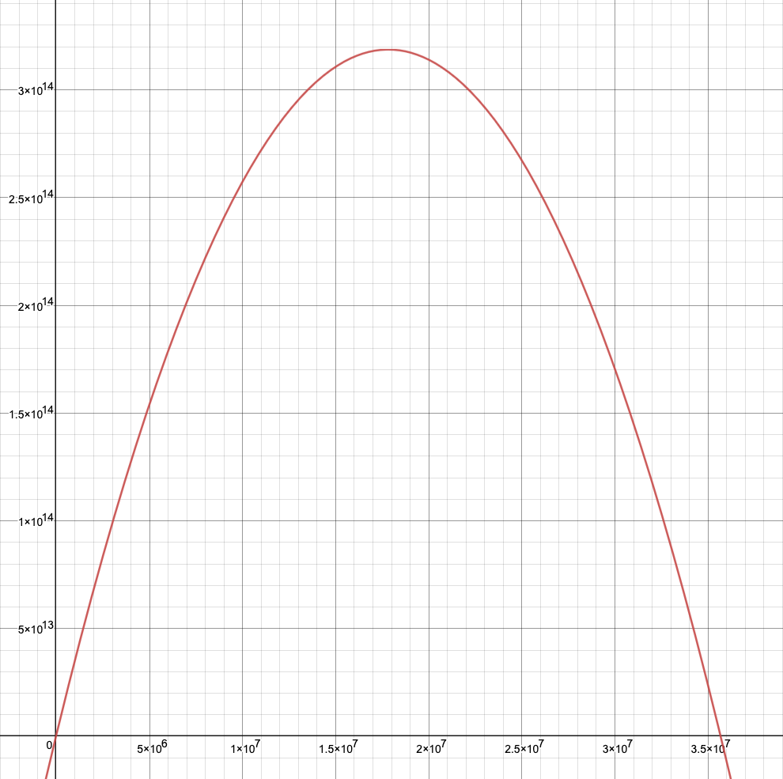
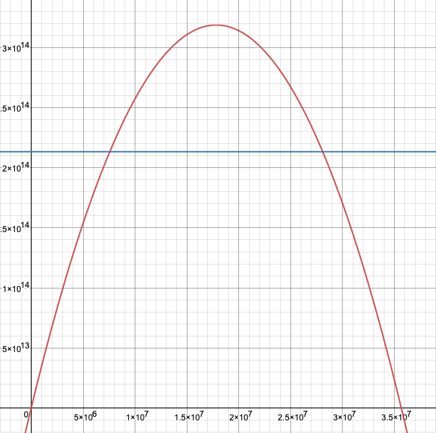
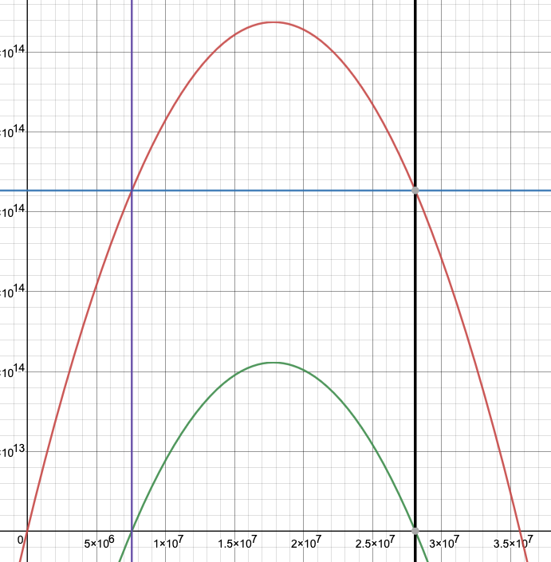

## notes - 2023

## day 6

alright, this one looks amenable to brute force, or at least part 1 does.

yup, part 1 easy to brute force.

part 2 is obviously less amenable to brute force, but it only has to run 35,696,887 iterations to simulate the race, and then the Enum.filter is also linear time against all 35 million. It finishes in about 15 seconds though. Good enough for now.

Ok - so I was sittin' on the toilet, and thinking about this problem. It's obviously some sort of math problem. There is a formula for figuring out the distance traveled for each amount of time holding down the button. So there must be a way to figure out what that equation looks like, and then solve for the contraint.

So I think it's something like this. d is the distance traveled, and t is the amount of time holding down the button. then there's a constant, we'll call it C, which represents the total time we have for the race.

$$d = t * (C - t)$$

Ah-ha - it's just a quadratic equation / parabola. And that makes sense - there's going to be 0 points at t=0 and t=C (because in either of those cases the boat doesn't move). Every point between those points has some positive value for the movement of the boat. In the middle of the parabola (its vertex) is the maximum possible distance. And for every value of of t to the right of the vertex, we start losing distance.

So god, i don't remember how to do this. I guess I need to figure out.... for the range of t=0..C, all the values of d that are greater than the "distance record". and doing that will involve finding the roots of the parabola / equation, but might also need some sort of shift to account for the limit.

OK - yes, that's right. Googling around a bit, this is starting to come back to me.

OK so. A quadratic equation describing a parabola looks like $y = ax^2 + bx + c$.

And we can use the quadratic formula to get the roots of the equation - which are the points where the graph of the parabola crosses the x axis, i.e., the points where $y = 0$. To do this we write the equation with y set to zero, like this: $ax^2 + bx + c = 0$. Then we can just plug the coefficients into the quadratic formula and solve:

$$x = \frac{-b \pm \sqrt{b^2 - 4ac}}{2a}$$

And this gives us the places where y = 0.

But for our application, we're interested in something slightly different. We need to know the range of values of $t$ (the amount of time we hold the button) which results in a value greater than the distance record. we'll call that value $d$.

Now, for the sake of building intuition, lets think about the code and how it relates to our equation.

We calculate the distance that a boat travels with this block of code. `time_holding_button` comes in from the "loop" (not really a loop, we `Enum.map` over the range of possible `t`s for a given race.)
``` elixir
      ms_per_s = time_holding_button
      remaining_seconds = race_time - time_holding_button
      distance = ms_per_s * remaining_seconds
```
* `ms_per_s` is the speed at which the boat travels, and it's equal to the number of seconds we hold down the button. (It's acutally milliseconds, per the puzzle text, but not important here).
* `remaining_seconds` is the amount of time left for the boat to travel. Remember that for each race we have a set amount of `race_time` in which the race occurs. So the remaining number of seconds is the total `race_time` minus how long we held the button.
* Then, `distance` is just how fast we're going per second multiplied by the remaining time in the race.

So, above, I expressed this equation as: $d = t * (C - t)$, but let's see it with our var names for clarity:
$$distance = time\_holding\_button * (race\_time - time\_holding\_button)$$

Call `distance` $d$ and `time_holding_button` $t$, and the constant `race_time` $R$, and we get that original equation:
$$d = t(C - t)$$

So if we want to plot this on an x,y plane, then our y value will be the distance the boat travels, and the input x is how long we hold the button. This gives us the same equation, but with x and y:
$$y = x(C - x)$$

And if we manipulate that equation, we get the familiar form of a quadratic equation. lets change the $C$ to $B$ for the sake of not being confused with the constant in the normal $ax^2 + bx + c$ form:
$$ y = -x^2 + Bx $$

From this equation we can determine a few things, and the most important of those is that the parabola is going to open downward. Again, this makes sense - our two roots are at $x = 0$, and those are the two points which represent not holding the button at all or holding it through the entire `race_time`. The $y$ values to the left or right of those roots don't make any sense - those to the left would represent holding the button for a negative amount of time (a negative $x$), and those to the right would represent holding the button longer than the race (at which point the values are technically wrong, because they're no longer defined by our function at that point). Our function is really limited to the domain of $t$ which would be valid in our race.

Ok, so that establishes some intuition for what our function describes and the parts of the domain we're interested in. But let's try to prime our intuition even more before we get back to numbers. Text is nice, but you know what they say - so we really need to be able to see the graph of the function to get a sense of what's going on here.

This is a plot of our function. Remember that our $B$ coefficient is enormous - it's the range of time available in the race, and from parsing the puzzle input we can find out that it's 35,696,887.

$$y = -x^{2\ }+35696887x$$



Because the constant in our problem is humongous, and because this equation involves an exponent, we end up with a really tall and narrow graph, even if we "zoom out" to a pretty crazy degree. I messed with the axes on this graph to make it a little easier to see the whole thing in one image - but note that we're working with some seriously huge numbers here, and also notice that the scale on the y axis is many orders of magnitude greater than the scale of the x-axis.

We can see that this plot matches up with some of the intuition we developed above. For x values below 0, the y value (distance traveled by the boat) is negative. And for x values above 35,696,887, $y$ is also negative.

Because this quadratic equation doesn't have a $c$ constant, it's fairly easy to see the roots are 0 and 35,696,887 just with some simple manipulation of the equation - we don't even need the quadratic formula to do this. For both of these equations, we don't even need to plug the constant in to be able to see the roots.

$x=0$ is the trivial case, even someone as bad at math as me can see this equality checks out.
$$
\begin{aligned}
0 &= 0^2 + b * 0
\\0 &= 0 + 0
\end{aligned}$$

If we set x to our big constant ($x=35,696,887$) it's a little harder, but not by much.
$$
\begin{aligned}
0 &= 35,696,887^2 - (35,696,887 * 35,696,887)
\\0&= 35,696,887^2 - 35,696,887^2
\end{aligned}$$

While working through this problem, I noticed something. For any quadratic that we can express like $y=x^2-bx$, or equivalently $y=-x^2+bx$, the roots will always be 0 and $b$. After playing with it a while, it's apparently critical that $a = 1$ or $a = -1$ and that the sign of $b$ is flipped from $a$.

To see more generically that $x=0$ and $x = b$ are the solutions for $0 = -x^2 + bx$, we can use the quadratic formula. Since equations in this form don't have a constant $c$, we plug in $c=0$, which simplifies the quadratic formula a bit. We're interested in solving the equation in terms of $b$, so we also need to plug in our constant for $a$ - in this case, $a=-1$.

$$
a = -1\\
c = 0\\
\begin{aligned}

\\x &= \frac{-b \pm \sqrt{b^2 - 4ac}}{2a}
\\x &= \frac{-b \pm \sqrt{b^2 - 4(-1)(0)}}{2*(-1)}
\\x &= \frac{-b \pm \sqrt{b^2}}{-2}
\\x &= \frac{-b \pm b}{-2}
\\
\\x_1 &= \frac{-b + b}{-2}
\\x_1 &= \frac{0}{-2}
\\x_1 &= 0
\\
\\x_2 &= \frac{-b - b}{-2}
\\x_2 &= \frac{-2b}{-2}
\\x_2 &= b

\end{aligned}
$$

Just to double check my intuition, let's do the same thing to find the roots for the form $0 = x^2 - bx$. Because the quadratic equation wants a positive b, we need to account for the fact that b is negative in this form. We can just flip the signs on all the bs through the equation, but to make it more obvious what's going on, we'll express $-b$ as $b = (-1)*b. This is kind of unnecessary as the two negative signs cancel quickly, but it helped my intuition to see things worked out at this level of detail.

$$
a = 1\\
b = -1 * b\\
c = 0\\
\begin{aligned}

\\x &= \frac{-b \pm \sqrt{b^2 - 4ac}}{2a}
\\x &= \frac{-(-1 * b) \pm \sqrt{(-1 * b)^2 - 4(-1)(0)}}{2a}
\\x &= \frac{(-1)(-1 * b) \pm \sqrt{(-1 * b)(-1 * b) - 0}}{2a}
\\x &= \frac{(1 * b) \pm \sqrt{(-1 * b)(-1 * b)}}{2a}
\\x &= \frac{b \pm \sqrt{(-b)(-b)}}{2a}
\\x &= \frac{b \pm \sqrt{b^2}}{2*(1)}
\\x &= \frac{b \pm b}{2}
\\x &= \frac{b \pm b}{2}
\\
\\x_1 &= \frac{b + b}{2}
\\x_1 &= \frac{2b}{2}
\\x_1 &= b
\\
\\x_2 &= \frac{b - b}{2}
\\x_2 &= \frac{0}{2}
\\x_2 &= 0

\end{aligned}
$$

Ok. So we've basically dissected this little quadratic equation, and we know quite a lot about how it works now. But we're not quite to the answer we're looking for yet, because remember - we aren't really that interested in the roots of the equation. Instead, what we need to figure out is the answer to this question: What is the range of values in the domain for which $y > target\_distance$ - the distance which we have to beat to win the race.

So, what we really need to do is to find the roots of the equation not at $y=0$, but at the line $y = target\_distance$. Just like our total time available for the race (which we've been calling $B$), we get the target distance from our puzzle input, and it's a _really_ big number: 213,116,810,861,248 (that's 213 _quadrillion_).

Plotting our quadratic ($y = -x^2 + 35,696,887x$), and this horizontal line ($y = 213,116,810,861,248$) gives us this graph:



So now, we just need to find the places where the parabola crosses our new line - that is, the places on the graph where $y = target\_distance$. Any values for x which are between these new roots will beat the current record distance defined by the problem. And conveniently, we have the quadratic formula, which we can use to find the roots of any parabola. But remember - in order to use the quadratic formula, we need our quadratic equation to be in this form to get the right values for $a$, $b$, and $c$:

$$ 0 = ax^2 + bx + c$$

Luckily, what we have is pretty easy to manipulate into that form:
$$ \begin{aligned} \\213,116,810,861,248 &= -x^2 + 35,696,887x \\ 0 &= -x^2 + 35,696,887x - 213,116,810,861,248 \end{aligned}$$

Plotting this new equation, on the same graph as our previous equations, gives us this picture. To make it easier to see the significance of the relationship betwene our two parabolas, I added two vertical lines to the plot. This makes it easy to see that our new parabola's roots on the $x$ axis are the same as the roots of the previous parabola on the line $y = 213,116,810,861,248$.



Now that we have our new equation expressed in the $0 = ax^2 + bx + c$ form, all that's left is to plug those values into the quadratic equation, and solve it. This gives us the roots for the parabola, and any values of $x$ between these numbers will result in our boat winning the race. The numbers here get huge - but the math is straightforward.

$$ 0 = -x^2 + 35,696,887x - 213,116,810,861,248
\\ \begin{aligned}a &= -1
\\ b&=35,696,887
\\ c &= -213,116,810,861,248\end{aligned}$$

$$
\begin{aligned}
x &= \frac{-b \pm \sqrt{b^2 - 4ac}}{2a}
\\x &= \frac{-35,696,887 \pm \sqrt{35,696,887^2 - 4*(-1)*(-213,116,810,861,248)}}{2(-1)}
\\x &= \frac{-35,696,887 \pm \sqrt{1,274,267,741,490,769 - 852,467,243,444,992}}{-2}
\\x &= \frac{-35,696,887 \pm \sqrt{421,800,498,045,777}}{-2}
\\x &= \frac{-35,696,887 \pm 20537782.20854864}{-2}
\\
\\ x_1 &= \frac{-35,696,887 + 20,537,782.20854864}{-2}
\\ x_1 &= \frac{-15159104.791451361}{-2}
\\ x_1 &= 7579552.3957256805
\\
\\ x_2 &= \frac{-35,696,887 - 20,537,782.20854864}{-2}
\\ x_2 &= \frac{-56,234,669.208548635}{-2}
\\ x_2 &= 28117334.604
\end{aligned}
$$

Alright, so now we have our roots. All the integers between $x_1$ and $x_2$ are valid solutions to the puzzle (i.e. an amount of time to hold down the button that results in a race-winning distance). We just need to count the total number of integers between our two values. That is, we want the whole range of *integers* that are >= x1, and <= x2 - or: $\{ n \in \mathbb{Z} \mid x_1 < n < x_2 \}$.

Counting the number of integers in this range is easy, intuitively - but implementing it mathematically is slightly <em>counter</em>intuitive. Intuitively, you look at the numbers, you pick the next integer after the lower root, the highest integer before the higher root, then subtract these two numbers and add 1. So the formula goes something like:

$$
\begin{aligned}
solution = \lfloor x_2 \rfloor\ - \lceil x_1 \rceil + 1
\end{aligned}
$$

The problem with implementing this in code is that it fails if you end up with an integer root, because the floor or ceil of an integer is just that integer - that is:
$$
\left\lfloor n \right\rfloor = \left\lceil n \right\rceil = n, \quad \text{if } n \in \mathbb{Z}
$$

It turns out the better way to implement this in code is to take the _floor_ of the lower root and add 1, and to take the _ceil_ of the higher root and subtract 1. Then we can get the solution like so:

$$
\begin{aligned}
solution = (\lceil x_2 \rceil - 1) - (\lfloor x_1 \rfloor + 1) + 1
\end{aligned}
$$

It's worth noting that this formula only works for quadratics of the form $-x^2 +bx$. If the sign of $b$ is negative, we'll have negative roots, and so we'd have to shuffle the floors and ceils around. But that's ok, since we know all our equations will be in that form for this puzzle.

Plugging our roots into this formula gives:

$$
\begin{aligned}
\\ x_1 &= 7579552.3957256805
\\ x_2 &= 28117334.604
\end{aligned}
\\
\begin{aligned}
\\solution &= (\lceil 28117334.604 \rceil - 1) - (\lfloor 7579552.3957256805 \rfloor + 1) + 1
\\solution &= (28,117,335 - 1) - (7,579,552 + 1) + 1
\\solution &= (28,117,334) - (7,579,553) + 1
\\solution &= (28,117,334) - (7,579,553) + 1
\end{aligned}
\\
solution = 20,537,781
$$

This matches the solution we got from our initial brute force algorithm, so we're done! Now all we need to do is translate this process into our Elixir code. The resulting function is pretty simple:

```elixir
  @doc """
  Solves the race using the quadratic equation. This only
  works for quadratic equations of the form -x^2 + bx, which
  is what our problem uses.
  """
  def solve_race({race_time, distance_record}) do
    discriminant = race_time ** 2 - 4 * -1 * -distance_record
    sqrt_discriminant = :math.sqrt(discriminant)

    x1 = (-race_time + sqrt_discriminant) / -2
    x2 = (-race_time - sqrt_discriminant) / -2

    (ceil(x2) - 1) - (floor(x1) + 1)
  end
```

Running our test suite with this new implementation provides a huge speedup to our code. The brute-force version of the algorithm took around 15 seconds for the huge part 2 numbers, where as this one finishes almost instantly.

It's interesting to think a little bit about the time complexity of the two algorithms. Let's take a look at the initial brute force solution.

```elixir
  def simulate_race({race_time, distance_record}) do
    Enum.map(1..(race_time - 1), fn time_holding_button ->
      ms_per_s = time_holding_button
      remaining_seconds = race_time - time_holding_button
      distance = ms_per_s * remaining_seconds

      {time_holding_button, distance, distance > distance_record}
    end)
  end
```

`simulate_race` takes the `race_time` and `distance_record` as parameters, then it maps over the range of `1..(race_time - 1)`, manually calculating the distance achieved by the boat for each possible `time_holding_button`. It adds a third value to the tuple, `distance > distance_record`. If this is `true`, then the input was a win, if not, the input didn't beat the record.

At this point, all we need to do is count the number of winning inputs in our set of possibilities:

```elixir
  def part_2_brute_force(input) do
    input
    |> process_input_2()
    |> simulate_race()
    |> Enum.filter(fn {_, _, win} -> win end)
    |> Enum.count()
  end
```

The only difference between the `part_2_brute_force` and `part_1_brute_force` functions is that in Part 1, we interpreted our data as describing more than one race, so we need to run our simulation of each possible input for each of those races.

So, if we think about our algorithm for simulating inputs to each race, we can realize that it does a constant amount of work for each number in its range. That means the runtime complexity of the function is $O(n)$. There's an "outer loop" in the case of Part 1, since we need to run our $O(n)$ algorithm once for each race in the input - but since there's only 4, this doesn't really make much difference.

In the case of Part 2, we only need to do a few math operations for any given race. This means the algorithm has a constant runtime - $O(1)$.

In both cases, the math operations aren't very expensive. A computer can obviously perform a handful of multiplications extremely quickly. But once you have to do it a few hundred quadrillion times, those very fast runtimes add up.

As a general rule, I'd be more than happy with a 15 second runtime for one of these problems, but it's still cool to understand that with a little math, it can be basically instaneous.

When I run into one of these problems that has some kind of increase in time complexity, I often enjoy writing a benchmark for it. The library I use for this in Elixir is [benchee](https://github.com/bencheeorg/benchee), which has some nice features and is overall just pleasantly easy to use.

Here's the simple test case I wrote with Benchee:
```
Benchee.run(
  %{
    "brute force" => fn input -> Aoc2023.Day06.simulate_race(input) end,
    "math version" => fn input -> Aoc2023.Day06.solve_race(input) end
  },
  inputs: %{
    "small case from sample" => {7, 9},
    "bigger case from sample" => {30, 200},
    "bump it up more" => {30000, 500_000},
    "part 2 input" => {35_696_887, 213_116_810_861_248},
    "even bigger input" => {435_696_887, 2_213_116_810_861_248}
  }
)
```

And here's the output of running the benchmarking suite:
```
##### With input small case from sample #####
Name                   ips        average  deviation         median         99th %
math version        5.83 M      171.47 ns ±13983.47%         145 ns         216 ns
brute force         2.23 M      447.79 ns  ±6449.45%         331 ns         667 ns

Comparison:
math version        5.83 M
brute force         2.23 M - 2.61x slower +276.32 ns

##### With input bigger case from sample #####
Name                   ips        average  deviation         median         99th %
math version        5.55 M       0.180 μs ±13066.58%       0.146 μs        0.22 μs
brute force         0.98 M        1.02 μs  ±2048.99%        0.86 μs        1.29 μs

Comparison:
math version        5.55 M
brute force         0.98 M - 5.67x slower +0.84 μs

##### With input bump it up more #####
Name                   ips        average  deviation         median         99th %
math version        6.41 M     0.00016 ms ±16668.17%     0.00012 ms     0.00019 ms
brute force      0.00091 M        1.09 ms    ±12.62%        1.07 ms        1.54 ms

Comparison:
math version        6.41 M
brute force      0.00091 M - 7013.29x slower +1.09 ms

##### With input part 2 input #####
Name                   ips        average  deviation         median         99th %
math version        6.02 M      0.00000 s ±12560.12%      0.00000 s      0.00000 s
brute force      0.00000 M         8.47 s     ±0.00%         8.47 s         8.47 s

Comparison:
math version        6.02 M
brute force      0.00000 M - 50996397.84x slower +8.47 s

##### With input even bigger input #####
Name                   ips        average  deviation         median         99th %
math version        5.70 M    0.00000 min ±13078.74%    0.00000 min    0.00000 min
brute force      0.00000 M       7.66 min     ±0.00%       7.66 min       7.66 min

Comparison:
math version        5.70 M
brute force      0.00000 M - 2619587031.25x slower +7.66 min
```

So, first observation is even for a tiny input that's only running a handful of iterations, the math version finishes in half the time. The next two inputs line up approximately with the $O(n)$ runtime, increasing about an order of magnitude for each order of magnitude in the input. As we get into higher numbers, the slowdown starts to get more pronouced - I think this is probably due to the cost of inserting a value into a map in Elixir, which iirc is $O(log n)$. As our n increases, we start to pay more and more for that insertion.

## day 5
dammit, i should have known when i saw those giant numbers in the input that the "naive" approach wasn't going to work. since some of the range lengths given in the real input are in the hundreds of millions, i'm guessing that my current approach isn't going to work. although i am tempted to just run it and see how long it takes. for fun, i'm going to stick a timeout infinity on the test and just let it chooch. ns are huge, but i think processing each line is linear time, so i don't think we're looking at like... end of the universe kind of timelines here. but we'll see how long it takes. i think the real problem is we're going to be creating a bunch of maps with hundreds of millions of entries. Map access is O(log n) but with that amount of entries, that's still catastrophically slow. (edit: ran for at least 30 minutes, killing it.)

this is a good opportunity for the year's first benchmark test, i guess.

so the trick, instead, is going to be some way to translate those mappings into a
function which spits out the right number given an input.

so, given a source, i think i'd need to check if it's in any of the ranges given in the mappings, and then apply some transformation to the source.

Maybe there's another trick by utilizing only the known necessary ranges. we could
determine them for each step. so basically check the input seeds against the ranges for the seed-to-soil map and figure out which values would get handed to the soil-to-fertilizer map and so forth. i think we still have to solve basically the same problem to do that though, so maybe not much juice for the squeeze there.

skimming the code, i think that the process_input function and the part_1 logic are similar. but create_mapping has to be different, and probably get_destination changes as well to take advantage of that.

---

ok, got part 1. pretty happy with this solution. it may be slightly overly clever with creating a function to act as the "value" for each range as a key. you could probably just as easily find the correct range for the destination, and then use the source range start and end to figure out the answer. but this feels pretty neat, so works for me.

---

Part 2 - agh, wastl, you bastard.

So this is the same _kind_ of issue, but ... harder. We won't be able to work with individual seed numbers, since there will be over a billion of them. Even if it only takes like a microsecond per check, that's still 15-20 minutes of run time.

So one thought I had is that we only really need to check the lowest number in each source range. Any number higher than that lowest number would get a higher number in its destination range. UNLESS (and here's the tricky bit) the range of seeds corresponds to multiple ranges of destinations. And there's an additional complication, which is that there may be numbers in a range of seeds which don't correspond to any destination range, and one of those may be the lowest number.

So I guess what we'd need to do is ... for each range of input source numbers, figure out which of the source ranges in the mapping it could cover. then the lowest number in any of those ranges would be the input to the next part? but the problem there is that you would lose information on each round. so i guess the input to each round has to be a set of ranges. and any given starting range may break down into multiple ranges, and also into single values. UGH

---

ok so i walked away and did some thinkin

so what if instead of "get locations" we had a "get destination ranges"

we pass a set of ranges into one of the mapping
and out comes a set of ranges which can go into the next mapping.

for each range we need to figure out the set of destination ranges

so let's call range 1 a..b and range 2 x..y

easy case - a >= x and b <= y. a is fully inside b - destintions = a..b

but if a >= x and b >= y then only part of a is inside y - a..y
same idea for the other "overlap", you get x..b

so then once you get for example x..b of those you need to figure out the mapping for a..x. similar process.

at the end you may be left with numbers outside any range, gotta think about what to do with those.

---

ok, it's done. the code is pretty gnarly, but i'm honestly not sure how it could be made
less complicated - i think the problem is just complex! thank god for elixir's pattern matching
and range handling, because the amount of manual labor that would have been added if not
for those two things might have just made me give up.

overall, despite being very and complicated, i'm happy with my solution. it runs really fast so that's cool. and I think the recursion in destination_ranges was probably the best way
to solve the problem, even though the internals of the function are the most complicated part
of the code. i also still like the clever "map a range to a function" solution for part 1.

two things that would be interesting to try - see if there's a way to solve both parts with the part 2 input (which would reduce the amount of code pretty substantially). this feels like it might be more trouble than it's worth though. since you actually care about a specific value in a range for part 1, you'd have to maintain offsets through the whole pipeline to get it out the end.

another interesting thing would be to run benchmarks with the initial naive solution and the "good" one. but honestly i've already spent way too much time on this problem, so on to the next one.

## day 4
wooooooof. should have known with an easy part 1 that part 2 would be gnarly.

I think the "architecture" of the solution is good. Basically, for each card, update the copies of the next card, and just iterate through the whole deck. But damn that part_2 is some ugly code.

one pitfall here was trying to use reduce_while. I read one of the instructions in the puzzle as requiring me to stop early, but that added a bunch of needless complexity to the code. If you always update the subsequent cards, you basically only need to go through the deck once, so a regular reduce using the size of the "deck" works just fine.

another place that added some crufty code was using a map to represent the "matched" and "copies" properties on each card. this could have really just been a tuple and saved a good chunk of code in the middle.

actually, went back and did that - saves some code, but maybe at a slight readability cost. idk. did a couple other minor refactors too, not too shabby honestly.

last thing i'd note is that i'm basically simulating a nested for loop with the two reduces over ranges in the solution. doesn't feel super elixir-y but whatever.


## day 3

well, that turned out to be a fairly large solution. i am always so damn happy to be able to use my grid thing though. this is my favorite kind of advent of code problem, where all of a sudden once you've solved the first half, the second is pretty easy. i probably spent 95% of the time doing part one, but once I had the stuff for finding adjacent part locations, and for filtering down grid positions, part 2 was easy.

grid module got a new function - `matching_locs`, which returns a list of all the grid positions which return true for a given function. that's a pretty nifty thing to have. who knows if i'll ever use it again?!

preliminary brainstorming:
ok, this is an interesting one. and of course it's got a grid, which means I have to decide whether my grid module is useful or not.

in this case, i think the main value of it is just that it can save some work processing the input into a usable format

so the basic idea would be to get the list of all the symbols, and then for each one, search for adjacent numbers. that part is a bit tricky, because the current "grid methodology" doesn't really have any way to identify that a number stretches across multiple cells.

Grid has a "neighbors" and "neighbor_locs" function, which could be used to check cells adjacent to a symbol's position for digits. then the only tricky part is determining the numbers that those digits are part of.

one idea i have is that during the processing of the grid, i could set the value at each position occupied by a number to the "whole" number. so that for something like this:

```
.16.
....
```

we would get a grid with positions:
```
%{
    {1, 0} => 16,
    {2, 0} => 16
}
```

as opposed to the "naive":
```
%{
    {1,0} => 1,
    {2,0} => 6
}
```

the problem with that approach is that it potentially causes a duplication issue - with something like:

```
.16.
..#.
....
```
In that case, Grid.neighbors would return two 16s, and you'd have no real way of knowing that you were double-counting the same "part number". this is actually still a problem even with the "naive" approach, because you have to be able to tell if any given neighbor cell is (or is not) part of a bigger number.

so maybe the idea is something like this. take a symbol's location. add its neighbors to a list of cells to search for numbers. and for each of those cells, we need to search left and right. if, during that search, a cell is found to contain a number, then you'd need to remove that cell from the list of cells that need to be checked. that way, we'd avoid double-coutning.

## day 2
this one didn't feel especially difficult, but there was a lot of work around processing the input into a usable format. i guess the data structure i landed on was decent because writing the actual "business logic" of the puzzle didn't take all that long once i'd done that.

i went a little "extra mile" in terms of testing here, and i will say that that turned out _not_ to help me in one place - I had forgotten to put "ors" between the clauses in &game_within_limit, but my test cases didn't catch that problem. relatively easy to find and fix but feels like one of those things where i could easily have torn my hair out for an hour before noticing those simple missing "ors".

one way that this might be slightly improved would be to define a struct for "pulls" formally and to create them using a "new" function to handle the defaults. as it stands, some of this code only works because i know that i'm not going to make pulls in any place other than "process_pull". This is pretty minor and totally fine for AoC, but there's some instinct that fires off when I do something like that, that somewhere down the line some dummy is going to create a pull that violates my assumptions. (that dummy would be me, of course). since I'll probably never re-use this code that's a bit of a misfire of the code smell circuits, but still, it's there.

## day 1

this was a surprisingly hard day 1 puzzle, took me 30-40 minutes to get it done. i think the approach i chose was good though, since i didn't get hung up on the "overlapping numbers" issue that apparently tripped some other people up.

just for fun, i refactored it down to be a little "tighter" - although honestly, this refactor is optimizing for cleverness over readability, and it's entirely unnecessary - especially DRYing the "part" function.

I think I could get it down even further - could basically define everything in line, but it would start requiring me to delete tests, so I'm going to leave it here. It might also be possible to do some regex voodoo that would eliminate the need for reversing the string, which could further condense the need for "first" and "last" functions, and let me just pass regexes, but that's getting severely stupid at that point.